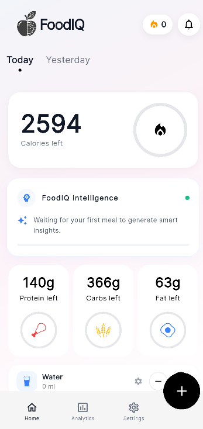
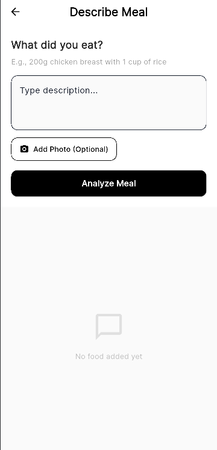
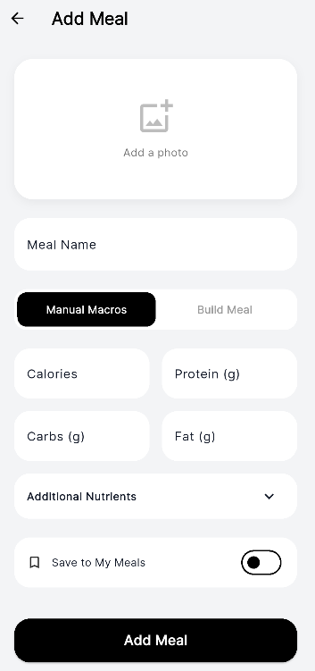
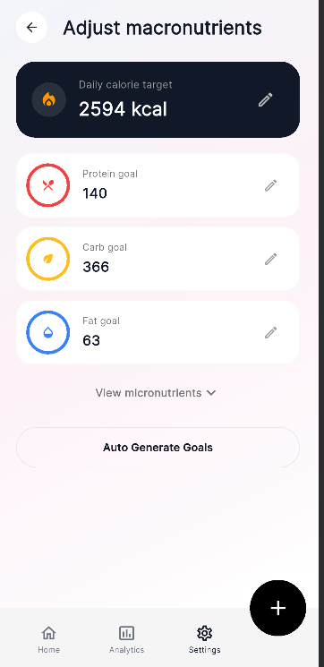
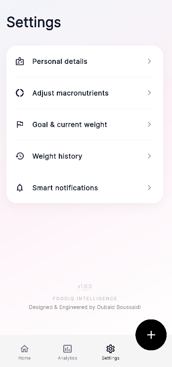
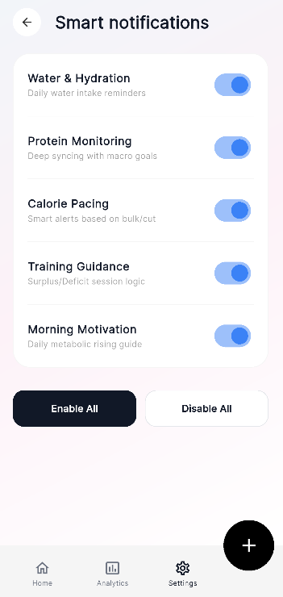

# FoodIQ (calAI) 🍎

**FoodIQ** is a premium, AI-powered nutritional intelligence platform designed to simplify tracking while providing deep, data-driven insights. Built with Flutter, it combines a sophisticated "Fancy Black" aesthetic with a high-performance, hybrid neural engine for a world-class user experience.

---

## 📸 App Interface

### Main Dashboard & Interaction

  
  
  

### Smart Meal Entry Flow

  
  
  

### Insights & User Control

  
  
  
  

---

## ✨ Key Features

### 1. Hybrid AI Analysis Engine 🧠
- **Natural Language Processing**: Describe your meal in plain English (e.g., *"I had two scrambled eggs with a large avocado and 100g of white rice"*) and the system will decompose the text into individual nutritional components.
- **Neural Offline Engine**: A proprietary offline NLP engine that performs fuzzy string matching and tokenization without an internet connection, ensuring extreme privacy and millisecond-level speed.
- **Continuous Learning**: The AI scanner and manual entry system are fully fused. Every database update is instantly learned by the AI engine.

### 2. Deep Progress & Biometric Tracking 📈
- **Weight Engineering**: Dedicated weight management system with historical trend analysis and goal-weight projection. Track your journey with precision-built linear charts.
- **Hydration Orchestration**: Smart water tracking with customizable serving sizes (250ml, 500ml, etc.) and real-time intake visualization.
- **Daily Performance Rings**: Visual macro-rings for Protein, Carbs, and Fat consumption relative to dynamic daily targets.
- **Activity Log**: Integration for steps and daily activity metrics to provide a 360-degree view of your health.

### 3. Smart Analytics & Streak System 🔥
- **7-Day Trend Intelligence**: Advanced bar charts and summary cards that compare current performance against previous periods.
- **Status Calendars**: Visual progress heatmaps for the last 7 days, allowing you to instantly identify streaks and missed targets.
- **Intelligent Streaks**: A built-in streak calculator that rewards consistency in both calorie and protein goal achievement.

### 4. Pro-Grade Food Database (200+ Items) 🥗
- **Curated & Specialized**: A hand-crafted library of over **200+ food items**, including premium proteins, complex carbs, and exotic vegetables.
- **Tunisian Mastery 🇹🇳**: Deep support for local brands (*Delice*, *Saida*) and traditional dishes (*Mloukhia, Couscous, Bsissa, Lablabi*) with brand-accurate macro profiles.
- **Zero Pork Policy**: Optimized for Mediterranean and healthy dietary lifestyles.

### 5. Smart Notification Ecosystem 🔔
- **Contextual Alerts**: Deeply integrated system that triggers based on your progress:
  - **Hydration Reminders**: Periodic nudges to stay hydrated.
  - **Macro Pacing**: Alerts when you're falling behind on protein or exceeding fat targets.
  - **Motivational Rising**: Daily metabolic rising guides and morning inspirations.
- **Granular Control**: Fully dynamic toggles in settings to customize your notification experience.

### 6. Personal Intelligence Settings ⚙️
- **Dynamic Goals**: Switch between **Auto-Generated Goals** (based on height, weight, and activity) or **Manual Pro-Mode** for exact macro control.
- **Goal Intensity Selection**: Configure your journey from "Lean Bulk/Cut" to "Aggressive Transformation" with real-time insight on your metabolic strategy.

### 7. Premium Neural Aesthetics 💎
- **Fancy Black Workspace**: A minimalist, high-contrast interface designed for professional-grade focus.
- **Interactive Visuals**: Orbital ring indicators, neural network particle systems in the loader, and shimmering state transitions.
- **Smart Branding**: High-fidelity custom iconography and a state-of-the-art "Smart Apple" circuit logo.

---

## 🏗️ System Architecture

FoodIQ's intelligence is built on an a service-oriented stack:

1. **Analytical Layer**: Segments natural language into Quantity, Modifier, Portion, and Food type tokens.
2. **Mathematical Resolver**: A dimensional orchestration layer that converts units across Mass, Volume, Count, and Multiplier to produce "Base Gram" values.
3. **Persistence Engine**: Powered by **Hive**, a lightweight NoSQL database for local-first, zero-latency data management.
4. **Notification Orchestrator**: Manages background alerts and localized notification scheduling for habit reinforcement.

---

## 🛠️ Technology Stack

- **Frontend**: [Flutter](https://flutter.dev/) (Dart)
- **Local Database**: [Hive](https://pub.dev/packages/hive)
- **State Management**: [Provider](https://pub.dev/packages/provider)
- **Data Visualization**: [fl_chart](https://pub.dev/packages/fl_chart)
- **AI Core**: Python (FastAPI) & Gemini 1.5 Pro (Google Generative AI)

---

## 🚀 Getting Started

### Installation & Launch
1. Initialize: `flutter pub get`
2. Generate Neural Adapters: `flutter pub run build_runner build --delete-conflicting-outputs`
3. Launch: `flutter run`

---

**Built with ❤️ for a healthier, smarter lifestyle. Designed & Engineered by Oubaid Boussaidi.**
